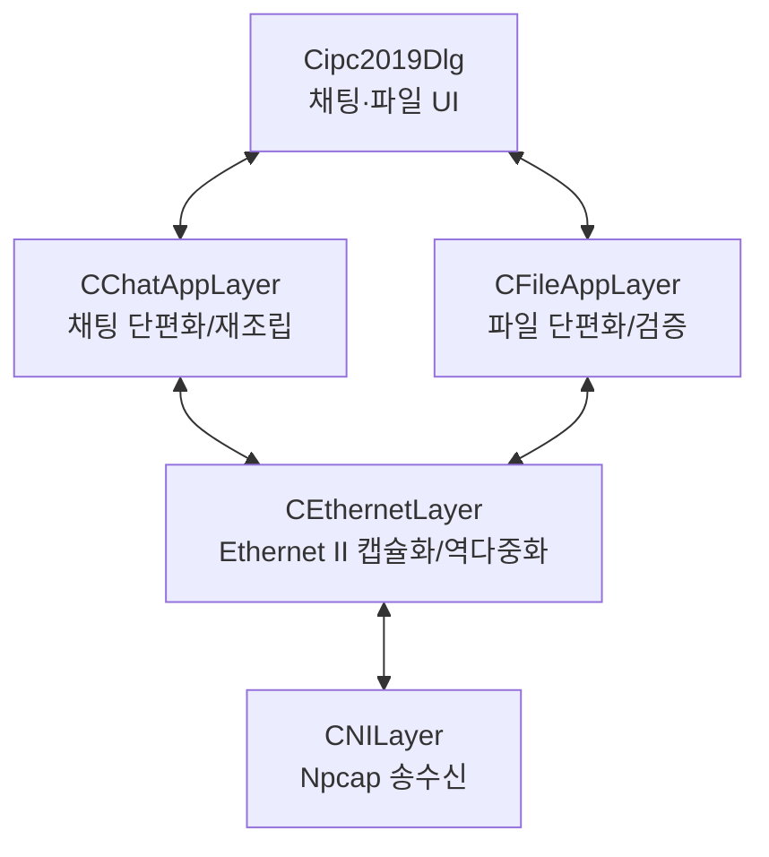

# Assignment 4 - Ethernet Chat & File Transfer 구현 설명

## 1. 구현 범위

기존 Assignment 3 코드는 삭제하지 않았다. 파일 기반 IPC 계층인 `CFileLayer`, 등록 메시지, ACK 및 타이머 함수는 그대로 남겨 두었고, Assignment 4 실행 경로만 Npcap 기반으로 분리하였다.

`stdafx.h`의 `ENABLE_LEGACY_IPC_ACK` 값은 기본적으로 `0`이다. 따라서 Assignment 4에서 채팅을 보낼 때 기존 2초 ACK 타이머가 시작되지 않으며, 정상 전송 뒤 잘못된 timeout 메시지가 나타나지 않는다. 이 상수는 기존 등록 메시지·ACK 함수의 소스 보존 여부가 아니라, 해당 레거시 알림 절차의 실행 여부만 제어한다.

## 2. 활성 프로토콜 스택



레이어 연결은 `CLayerManager::ConnectLayers()`에 다음 문자열을 전달하여 구성한다.

```cpp
"NI ( *Ethernet ( *ChatApp ( *ChatDlg ) *FileApp ( *ChatDlg ) ) )"
```

`CBaseLayer`의 상·하위 레이어 포인터를 통해 송신은 위에서 아래로, 수신은 아래에서 위로 전달된다.

## 3. 프로토콜 형식

### Ethernet II frame

| 필드 | 크기 | 구현 |
|---|---:|---|
| Destination MAC | 6 bytes | UI에서 설정한 상대 MAC 또는 FF-FF-FF-FF-FF-FF |
| Source MAC | 6 bytes | Packet32의 `OID_802_3_CURRENT_ADDRESS`로 조회 |
| EtherType | 2 bytes | Chat 0x2080, File 0x2090 |
| Payload | 최대 1500 bytes | Chat App 또는 File App packet |

16비트 및 32비트 정수 필드는 `HostToNetwork16/32`와 `NetworkToHost16/32`를 사용하여 네트워크 바이트 순서로 변환한다.

### Chat App packet

| 필드 | 크기 | 의미 |
|---|---:|---|
| `capp_totlen` | 2 bytes | UTF-8 채팅 전체 길이 |
| `capp_type` | 1 byte | FIRST 0x00, MIDDLE 0x01, LAST 0x02 |
| `capp_unused` | 1 byte | 예약 필드 |
| `capp_data` | 최대 1496 bytes | 채팅 조각 |

한 frame에 들어가는 메시지는 FIRST 한 개로 전송하고, 1496 bytes를 초과하면 FIRST-MIDDLE-LAST 순서로 분할한다. 수신 측은 최초 조각의 전체 길이만큼 버퍼를 예약하고 모든 데이터가 모였을 때만 Dialog로 전달한다. 2바이트 전체 길이 필드 때문에 한 채팅 메시지의 구현상 최대 크기는 65,535 bytes이다.

### File App packet

| 필드 | 크기 | 의미 |
|---|---:|---|
| `fapp_totlen` | 4 bytes | 파일 전체 크기 |
| `fapp_type` | 2 bytes | FILE_TYPE_BINARY |
| `fapp_msg_type` | 1 byte | INFO 0x00, DATA 0x01, END 0x02 |
| `fapp_unused` | 1 byte | 예약 필드 |
| `fapp_seq_num` | 4 bytes | 조각 순번 |
| `fapp_data` | 최대 1488 bytes | UTF-8 파일명 또는 파일 데이터 |

INFO frame은 파일명과 전체 크기를 전달한다. DATA frame은 1488 bytes 단위의 데이터를 순번과 함께 전달한다. END frame을 받으면 수신 길이, 예상 순번, 전체 길이를 모두 비교한 뒤에만 `.part` 파일을 최종 파일명으로 변경한다. 수신 파일은 실행 파일 옆의 `ReceivedFiles` 폴더에 저장된다.

## 4. 송수신 과정

### 채팅 송신

1. Dialog가 입력 문자열을 UTF-8로 변환한다.
2. `CChatAppLayer`가 최대 1496 bytes 단위로 분할한다.
3. `CEthernetLayer`가 목적지·출발지 MAC과 EtherType 0x2080을 붙인다.
4. `CNILayer`가 `pcap_sendpacket()`으로 frame을 전송한다.

### 채팅 수신

1. `CNILayer::ReadingThread()`가 `pcap_next_ex()`로 frame을 수신한다.
2. `CEthernetLayer`가 목적지 MAC을 검사하고 자기 자신이 보낸 frame은 폐기한다.
3. EtherType 0x2080이면 Chat App 계층으로 payload를 전달한다.
4. Chat App 계층이 전체 메시지를 재조립한다.
5. Dialog에는 `PostMessage()`로 전달하여 수신 스레드가 UI 컨트롤을 직접 수정하지 않도록 했다.

### 파일 송신과 수신

파일 송신은 `CFileAppLayer::FileTransferThread()`에서 실행된다. 파일을 읽고 frame을 보내는 동안 UI 스레드는 계속 동작하므로 채팅과 파일 전송을 동시에 수행할 수 있다. NI 계층은 송신 임계 구역을 사용하여 채팅 frame과 파일 frame이 동시에 Npcap에 전달되는 경쟁 조건을 방지한다.

수신 측은 INFO-DATA-END 상태와 순번을 검사한다. 순번 누락, 전체 길이 불일치 또는 기록 오류가 발생하면 미완성 `.part` 파일을 삭제한다.

## 5. 과제의 빨간 요구사항 대응

| 과제 요구사항 | 구현 위치 |
|---|---|
| 모든 Layer가 `CBaseLayer` 상속 | ChatApp, FileApp, Ethernet, NI, legacy File 및 Dialog |
| Layer 연결에 LinkManager 함수 사용 | `Cipc2019Dlg` 생성자의 `ConnectLayers()` |
| Chat EtherType 명시 | `ETHERNET_TYPE_CHAT 0x2080` |
| File EtherType 명시 | `ETHERNET_TYPE_FILE 0x2090` |
| Chat 무제한형 단편화 | 1496-byte 단위 분할 및 재조립. 헤더 필드상 65,535-byte 한계는 보고서에 명시 |
| File 단편화 | INFO/DATA/END, 1488-byte DATA, 순번 검사 |
| 목적지 MAC이 다르면 폐기 | `CEthernetLayer::Receive()` |
| 출발지 MAC이 자기 것이면 폐기 | `CEthernetLayer::Receive()` |
| Frame Type에 따른 상위 전달 | 0x2080은 ChatApp, 0x2090은 FileApp |
| WinPcap/Npcap 송수신 | `CNILayer`의 `pcap_next_ex`, `pcap_sendpacket` |
| Packet32로 MAC 조회 | `PacketRequest(... OID_802_3_CURRENT_ADDRESS ...)` |
| NILayer 수신 Thread | `CNILayer::ReadingThread()` |
| File 전송 Thread | `CFileAppLayer::FileTransferThread()` |
| Thread 사용 계층과 이유 보고 | NI: 비동기 수신, FileApp: 채팅과 파일의 동시 실행 |
| Wireshark 결과 | 실제 두 PC 실행 후 별도 캡처 필요 |

## 6. 빌드 준비

1. Npcap 설치 시 **WinPcap API-compatible Mode**를 선택한다.
2. Npcap SDK를 별도로 내려받아 압축을 푼다.
3. Windows 환경 변수 `NPCAP_SDK_DIR`을 SDK 최상위 폴더로 설정한다.
4. Visual Studio에서 `ipc2019.vcxproj`를 열어 PC 환경과 같은 플랫폼(x64 또는 Win32)으로 빌드한다.

예시:

```powershell
$env:NPCAP_SDK_DIR = "C:\Npcap-SDK"
```

프로젝트는 다음 파일을 자동으로 참조하도록 수정되어 있다.

- Include: `$(NPCAP_SDK_DIR)\Include`
- Win32 Lib: `$(NPCAP_SDK_DIR)\Lib`
- x64 Lib: `$(NPCAP_SDK_DIR)\Lib\x64`
- Libraries: `wpcap.lib`, `Packet.lib`, `Ws2_32.lib`

## 7. 실행 확인 항목

1. 두 PC를 LAN으로 연결하고 Npcap이 인식한 유선 어댑터를 선택한다.
2. 상대 PC의 Source Ethernet Address를 Destination에 입력한다.
3. 양쪽에서 설정 버튼을 누른다.
4. 1496 bytes 이하/초과 채팅을 각각 전송한다.
5. 작은 파일과 1488 bytes를 초과하는 파일을 전송한다.
6. 수신 파일의 크기와 원본 파일의 해시를 비교한다.
7. Wireshark 표시 필터로 frame을 확인한다.

```text
eth.type == 0x2080 || eth.type == 0x2090
```

실제 Windows/Npcap 장치와 두 PC가 필요한 패킷 송수신 및 Wireshark 캡처는 해당 환경에서 최종 확인해야 한다.
